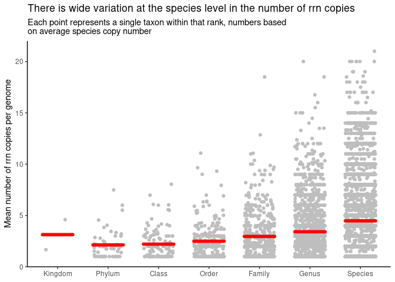

Quantifying the number of *rrn* operons across taxonomic ranks
================
G Bhatti; P Schloss
9/13/2024

``` r
library(tidyverse)
library(here)
library(ggridges)

metadata<- read_tsv(here("data/references/genome_id_taxonomy.tsv"),
                    col_types = cols(.default = col_character())) |> 
  mutate(strain=if_else(scientific_name==species,NA_character_,scientific_name)) |> 
  select(-scientific_name)


esv<- read_tsv(here("data/processed/rrnDB.easv.count_tibble"),
                        col_types = cols(.default=col_character(),
                                         count=col_integer())) |> 
  filter(threshold=="esv") |> 
  select(-threshold)


metadata_esv<- inner_join(metadata, esv, by=c("genome_id"="genome"))
```

### Plot the number of *rrn* copies per taxonomic rank

Our analysis will use fill length sequences. We want to count and plot
the number of copies per *taxonomic rank*. Before calculating the
averages for each taxonomic group, we should calculate average number of
copies for each species. This will allow us to control for uneven number
of genomes in each species. within each rank.

``` r
rank_taxon_rrns<- metadata_esv |> 
  filter(region =="v19") |> 
  group_by(kingdom, phylum, class, order, family, genus, species, genome_id) |> 
  summarize(n_rrns=sum(count),.groups = "drop") |> 
  group_by(kingdom, phylum, class, order, family, genus, species) |> 
  summarise(mean_rrns= mean(n_rrns),.groups = "drop") |> 
  pivot_longer(-mean_rrns,
               names_to = "rank",
               values_to="taxon") |> 
  drop_na(taxon) |> 
  mutate(rank=factor(rank,
                     levels=c("kingdom","phylum","class","order",
                              "family","genus","species","strain"))) |> 
  group_by(rank,taxon) |> 
  summarise(mean_rrns=mean(mean_rrns),.groups = "drop")

mean_of_means<- rank_taxon_rrns |> 
  group_by(rank) |> 
  summarise(mean_of_means=mean(mean_rrns),.groups = "drop")

median_of_means<- rank_taxon_rrns |> 
  group_by(rank) |> 
  summarise(median_of_means=median(mean_rrns),.groups = "drop")
```

``` r
jitter_width <- 0.3
n_ranks<-nrow(mean_of_means)
rank_taxon_rrns |> 
  ggplot(aes(x=rank,y=mean_rrns)) +   

  geom_jitter(width=jitter_width,color="gray") +
  # geom_point(data=mean_of_means,aes(x=rank,y=mean_of_means),
  #            color="red",size=3,inherit.aes = F)+
  # geom_line(data=mean_of_means,aes(x=rank,y=mean_of_means),
  #           color="red",size=2,group=1,
  #           inherit.aes = F)+
  geom_segment(data=mean_of_means,
               aes(x=1:n_ranks-jitter_width,xend=1:n_ranks+jitter_width,
                   y=mean_of_means,yend= mean_of_means),
               color="red",size=2,inherit.aes = F,lineend = "round")+
 # geom_boxplot(outlier.shape = NA,fill=NA)+
  theme_classic()+
  labs(x=NULL,
       y="Mean number of rrn copies per genome",
       title= "There is wide variation at the species level in the number of rrn copies",
       subtitle = "Each point represents a single taxon within that rank, numbers based\non average species copy number")+
  scale_x_discrete(breaks=c("kingdom","phylum","class","order",
                            "family","genus","species"),
                   labels=str_to_title(c("kingdom","phylum","class","order",
                            "family","genus","species")))
```

    ## Warning: Using `size` aesthetic for lines was deprecated in ggplot2 3.4.0.
    ## ℹ Please use `linewidth` instead.
    ## This warning is displayed once every 8 hours.
    ## Call `lifecycle::last_lifecycle_warnings()` to see where this warning was generated.

<!-- -->

Here’s another way of looking at the data…

``` r
rank_taxon_rrns |> 
  ggplot(aes(x=mean_rrns,y=rank)) +  
  geom_density_ridges(stat="binline",binwidth=1,scale=0.9)+
  # geom_density(alpha=0.2,adjust=1.5)
  # geom_histogram(binwidth =1,position = "dodge")
  geom_point(data=median_of_means,aes(y=1:n_ranks+0.1,x=median_of_means),
             color="red",size=3,inherit.aes = F)+

   theme_classic()+
  labs(y=NULL,
       x="Mean number of rrn copies per genome",
       title= "The distribution of rrn copies per genome is consistent across ranks",
       subtitle = "Each point represents a single taxon within that rank, numbers based\non average species copy number")+
  scale_y_discrete(breaks=c("kingdom","phylum","class","order",
                            "family","genus","species"),
                   labels=str_to_title(c("kingdom","phylum","class","order",
                            "family","genus","species")))
```

<!-- -->

- Bacteria have more copies than Archaea
- Even after correcting for the number genomes per species, there is is
  wide variation in the number of *rrn* operons per taxonomic group
