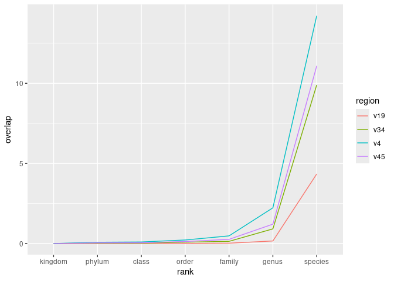

Quantifying the overlap of ASVs between taxa
================
G Bhatti; P Schloss
9/22/2024

``` r
library(tidyverse)
library(here)
library(knitr)

metadata<- read_tsv(here("data/references/genome_id_taxonomy.tsv"),
                    col_types = cols(.default = col_character())) |> 
  mutate(strain=if_else(scientific_name==species,NA_character_,scientific_name)) |> 
  select(-scientific_name)


asv<- read_tsv(here("data/processed/rrnDB.count_tibble"),
               col_types = cols(.default = col_character(),
                                count= col_integer()))


metadata_asv<- inner_join(metadata, asv, by=c("genome_id"="genome"))
```

### How often is the same ASV found in multiple taxa from the same rank?

From previous analysis (2024-09-21-asv-species-coverage.md), we know
that: \* a single genome can have multiple ASVs \* there may be as many
ASVs as there are genome sequences in a species Thus ASVs can split a
species and even a genome into multiple taxonomic groupings.

Now I want to know that if I have an ASV, what’s the probability that it
is also found in another taxonomic group from the same rank? For
example, if I have an ASV from *Bacillus subtilis*, what’s the
probability that it is also found in *Bacillus cereus*? Of course, it is
more likely to find a *Bacillus subtilis* ASV in a more closely related
organism like *Bacillus cereus* than *E. coli*. We may adjust/control
for relatedness later but let us now answer the general question for any
two taxa from the same rank.

``` r
# metadata_asv - input data
overlap_data<- metadata_asv |> 
# - focus on taxonomic ranks - from kingdom to species, asvs and region
select(-genome_id,-count,-strain) |> 
# - make data frame tidy
pivot_longer(cols=c(-asv,-region),
             names_to = "rank",
             values_to = "taxon") |> 
# - remove lines from data where we don't have a taxonomy
  drop_na(taxon) |> 
# - remove redundant lines
  distinct() |> 
# for each region and taxonomic rank, group by asvs
  group_by(region,rank,asv) |> 
# - for each asv - count the number of taxa
  summarize(n_taxa=n(),.groups = "drop_last") |> 
# - count the number of asvs that appear in more than one taxa
  count(n_taxa) |> 
# - find the ratio of # asvs appearing in multiple taxa to the total # of asvs
  summarize(overlap=100*sum((n_taxa>1)*n)/sum(n),.groups = "drop") |> 
  mutate(rank=factor(rank,levels=c("kingdom","phylum",
                                   "class","order","family","genus","species"))) 


# Create a plot showing specificity at each taxonomic rank for each region 
overlap_data |> 
# x= taxonomic rank
# y= specificity or  % of asvs found in more than one taxa
ggplot(aes(x=rank,y=overlap,group=region,color=region)) +
# geom= line plot
# different lines for each region of 16S rRNA gene
  geom_line()
```

<!-- -->

``` r
overlap_data |> 
  filter(rank=="species") |> 
  kable()
```

| region | rank    |   overlap |
|:-------|:--------|----------:|
| v19    | species |  4.344998 |
| v34    | species |  9.902491 |
| v4     | species | 14.222802 |
| v45    | species | 11.089297 |

### Conclusions

- The sub-regions are less specific at the species level than the
  full-length. Still full-length has about 4.3% overlap whereas the sub
  regions are between 9.9% and 11.1% overlap.
- This analysis does not control for uneven sampling of different
  species.
