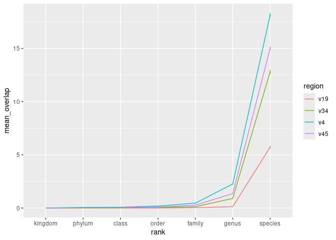

Quantifying the overlap of ESVs between taxa
================
G Bhatti; P Schloss
9/22/2024

``` r
library(tidyverse)
library(here)
library(knitr)

metadata<- read_tsv(here("data/references/genome_id_taxonomy.tsv"),
                    col_types = cols(.default = col_character())) |> 
  mutate(strain=if_else(scientific_name==species,NA_character_,scientific_name)) |> 
  select(-scientific_name)


esv<- read_tsv(here("data/processed/rrnDB.esv.count_tibble"),
               col_types = cols(.default = col_character(),
                                count= col_integer()))


metadata_esv<- inner_join(metadata, esv, by=c("genome_id"="genome"))
```

### How often is the same ESV found in multiple taxa from the same rank?

From previous analysis (2024-09-21-esv-species-coverage.md), we know
that: \* a single genome can have multiple ESVs \* there may be as many
ESVs as there are genome sequences in a species Thus ESVs can split a
species and even a genome into multiple taxonomic groupings.

Now I want to know that if I have an ESV, what’s the probability that it
is also found in another taxonomic group from the same rank? For
example, if I have an ESV from *Bacillus subtilis*, what’s the
probability that it is also found in *Bacillus cereus*? Of course, it is
more likely to find a *Bacillus subtilis* ESV in a more closely related
organism like *Bacillus cereus* than *E. coli*. We may adjust/control
for relatedness later but let us now answer the general question for any
two taxa from the same rank.

``` r
# set RNG seed to bday
set.seed(19841509)


get_subsample_result<- function(threshold)
{
  # metadata_esv - species, genome_ids
  subsample_species<- metadata_esv |> 
    select(genome_id,species) |> 
  # return the distinct/unique rows
    distinct() |> 
  # group by species
    group_by(species) |> 
  # slice_sample on each species for N geneomes
    slice_sample(n=threshold) |> 
    ungroup()
  
  good_species<- subsample_species |>  
  # count number of genomes in each species
    count(species) |> 
  # return species that have N genomes/filter out species with fewer 
    filter(n==threshold) |> 
    select(species) 
  
  # going back to original list of species/genomes -return genome_ids from
  # species with atleast  N genomes
  subsampled_genomes<- subsample_species |> 
    inner_join(good_species,by="species") |> 
    select(genome_id)
  
  
  # metadata_esv - input data
  overlap_data<- metadata_esv |> 
  # genome_ids from species with atleast  N genomes
  inner_join(subsampled_genomes,by="genome_id") |> 
  # - focus on taxonomic ranks - from kingdom to species, esvs and region
  select(-genome_id,-count,-strain) |> 
  # - make data frame tidy
  pivot_longer(cols=c(-esv,-region),
               names_to = "rank",
               values_to = "taxon") |> 
  # - remove lines from data where we don't have a taxonomy
    drop_na(taxon) |> 
  # - remove redundant lines
    distinct() |> 
  # for each region and taxonomic rank, group by esvs
    group_by(region,rank,esv) |> 
  # - for each esv - count the number of taxa
    summarize(n_taxa=n(),.groups = "drop_last") |> 
  # - count the number of esvs that appear in more than one taxa
    count(n_taxa) |> 
  # - find the ratio of # esvs appearing in multiple taxa to the total # of esvs
    summarize(overlap=100*sum((n_taxa>1)*n)/sum(n),.groups = "drop") |> 
    mutate(rank=factor(rank,levels=c("kingdom","phylum",
                                     "class","order","family","genus","species"))) 
  
  return(overlap_data)
}

subsample_iterations <- map_dfr(1:100,~get_subsample_result(threshold = 1),
                                .id="iterations")

summary_overlap_data<- subsample_iterations |> 
  group_by(region,rank) |> 
  summarize(mean_overlap= mean(overlap),
            lci= quantile(overlap,0.025),
            uci=quantile(overlap,0.975),
            .groups = "drop")

# Create a plot showing specificity at each taxonomic rank for each region 
summary_overlap_data |> 
# x= taxonomic rank
# y= specificity or  % of esvs found in more than one taxa
ggplot(aes(x=rank,y=mean_overlap,ymin=lci,ymax=uci,
           group=region,color=region)) +
# geom= line plot
# different lines for each region of 16S rRNA gene
  geom_line()+
  geom_linerange(show.legend = F)
```

<!-- -->

``` r
summary_overlap_data |> 
  filter(rank=="species") |> 
  kable(digits=1)
```

| region | rank    | mean_overlap |  lci |  uci |
|:-------|:--------|-------------:|-----:|-----:|
| v19    | species |          5.7 |  5.6 |  5.8 |
| v34    | species |         12.8 | 12.6 | 13.0 |
| v4     | species |         18.1 | 18.0 | 18.3 |
| v45    | species |         15.0 | 14.9 | 15.2 |

### Conclusions

#### analysis without controlling for uneven sampling of genomes across taxonomic levels

- The sub-regions are less specific at the species level than the
  full-length. Still full-length has about 4.3% overlap whereas the sub
  regions are between 9.9% and 11.1% overlap.
- This analysis does not control for uneven sampling of different
  species.

#### analysis when controlling for uneven sampling of genomes across taxonomic levels

- The sub-regions are less specific at every taxonomic rank than
  full-length sequences.
- Still full-length has about 5.7% overlap whereas the sub-regions are
  between 12.8% and 18.2% overlap.
