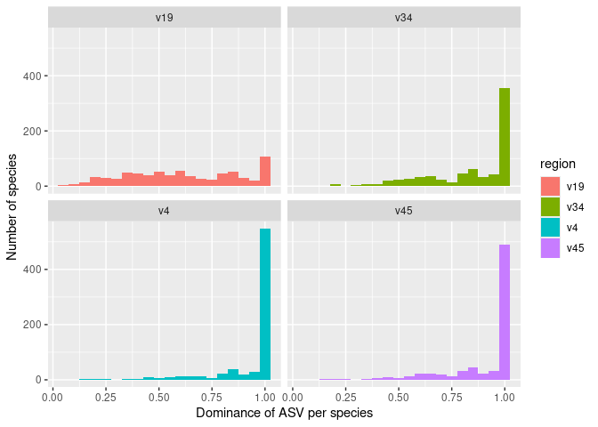
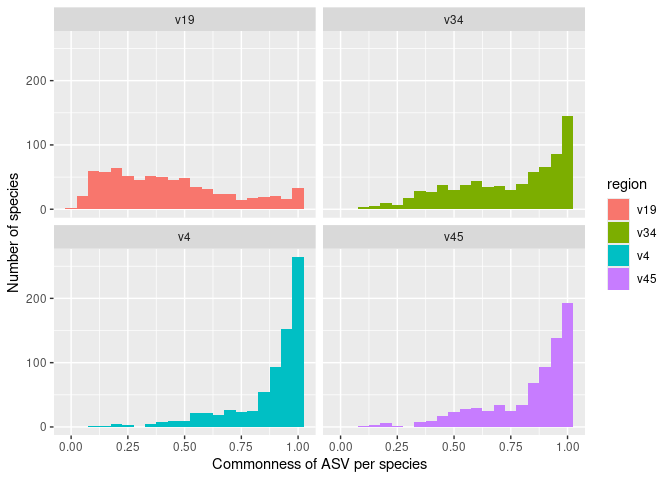

Quantifying the dominance and commonness of ASVs
================
G Bhatti; P Schloss
9/30/2024

``` r
library(tidyverse)
library(here)
library(knitr)

metadata<- read_tsv(here("data/references/genome_id_taxonomy.tsv"),
                    col_types = cols(.default = col_character())) |> 
  mutate(strain=if_else(scientific_name==species,NA_character_,scientific_name)) |> 
  select(-scientific_name)


asv<- read_tsv(here("data/processed/rrnDB.count_tibble"),
               col_types = cols(.default = col_character(),
                                count= col_integer()))


metadata_asv<- inner_join(metadata, asv, by=c("genome_id"="genome"))
```

There are many ASVs in a species but only a handful may be dominant.
When examining all genomes in a species: a) Which ASV (Amplicon Sequence
Variant) is the most prevalent? b) What proportion of the genomes
contain this most prevalent ASV?

``` r
# Want the number of genomes and the average number of 16S rRNA gene (rrn) copies  
# per genome for each species

n_genomes_rrn_copies_per_species<- 
metadata_asv |> 
  # need the counts by region and by genome for each species
  select(region,genome_id,species,asv,count) |> 
  # group our ASVs by region and species
  group_by(region,species) |> 
  # 
  summarize(# number of distinct genomes per region/species
    n_genomes=n_distinct(genome_id),
    # summing up the number of 16S rRNA copies across all 
    # genomes in a region/species & divide by the number of genomes
    mean_rrns=sum(count)/n_genomes,
    .groups = "drop") 


# set the minimum number of genomes per species
min_n_genomes_per_species=5

# What percentage of genomes in a species have an ASV? 
# Dominance is the proportion of genomes that an ASV is found in.If a ASV shows 
# up in 20 out of 25 genomes for a species, it's dominance is 0.8.

asv_dominance_per_species<- metadata_asv |>
  # want to analyse each region of 16S rRNA gene at the species level.
  # want to group our genomes by region, ASVs, and species to count the number 
  # of genomes that each ASV appears in.
  select(region,genome_id,species,asv,count) |> 
  group_by(region,species,asv) |> 
  # count the number of genomes that each ASV appears in for a region and species
  summarize(n_genomes_found= n_distinct(genome_id),.groups = "drop") |> 
  # bring in the number of genomes and rrn copies per species to 
  # calculate the fraction of genomes in which a ASV appears in (dominance).
  inner_join(n_genomes_rrn_copies_per_species,by=c("region","species")) |> 
  mutate(dominance=n_genomes_found/n_genomes) |> 
  # want the dominant ASV for each region and species 
  # want the number of genomes for each region and species so that we 
  # filter our data to focus on those species with more genomes than the
  # value of threshold
  group_by(region,species) |> 
  summarize(
    n_genomes=max(n_genomes),
    max_dominance=max(dominance),
    .groups = "drop") |> 
  filter(n_genomes>=min_n_genomes_per_species)
  
asv_dominance_per_species |> 
  ggplot(aes(x=max_dominance,fill=region)) +
  geom_histogram(binwidth = 0.05)+
  facet_wrap(facet="region")+
  labs(x="Dominance of ASV per species",
       y="Number of species")
```

<!-- -->

``` r
# What proportion of species have a max domininace of atleast 80%?
asv_dominance_per_species |> 
  group_by(region) |>
  summarize(fraction= sum(max_dominance>0.8)/n())
```

    ## # A tibble: 4 × 2
    ##   region fraction
    ##   <chr>     <dbl>
    ## 1 v19       0.289
    ## 2 v34       0.680
    ## 3 v4        0.865
    ## 4 v45       0.8

``` r
asv_commonness_per_species <- metadata_asv %>%
    # want to do our analysis for the species level for each region of 16S will
    # want to group our genomes by ASVs and species to count the number of genomes
    # that each ESV appears in
  select(region, genome_id, species, asv, count) %>%
  group_by(region, species, asv) %>%
    # instead of counting the number of genomes an ASV is found in, I want to
    # count the total number of times each ASV appears across the genomes within
    # a species
    summarize(n_asvs = sum(count), .groups="drop") %>%
    # bring in the number of genomes and rrn copies per species so we can scale
    # our number of times that each ASV appeared in each species to get percent
    # commonness
  inner_join( n_genomes_rrn_copies_per_species, by=c("region", "species")) %>%
  mutate(commonness = n_asvs/(n_genomes*mean_rrns)) %>%
    # want the most common ASV for each region and species
    # want the number of genomes for each species and region so that we can filter
    # our data to focus on those species with more genomes than the value of
    # threshold
    group_by(region, species) %>%
  summarize(n_genomes=max(n_genomes),
    max_commonness = max(commonness),
    .groups="drop") %>%
  filter(n_genomes >= min_n_genomes_per_species)

asv_commonness_per_species %>%
  ggplot(aes(x=max_commonness, fill=region)) +
    geom_histogram(binwidth=0.05) +
    facet_wrap(facet="region") +
        labs(y="Number of species", x="Commonness of ASV per species")
```

<!-- -->

``` r
# what percentage of species have an ASV that has a commonness over 80%
asv_commonness_per_species %>%
  group_by(region) %>%
  summarize(fraction = sum(max_commonness > 0.80)/n())
```

    ## # A tibble: 4 × 2
    ##   region fraction
    ##   <chr>     <dbl>
    ## 1 v19       0.125
    ## 2 v34       0.499
    ## 3 v4        0.778
    ## 4 v45       0.686

### Conclusions…

- Among the sub-regions, a majority of species have an ASV that is found
  in more than 80% of the genomes. For full-length sequences only 29% of
  the ASVs are found in more than 80% of the genomes.
- The most common ASVs (i.e. those found in more 80% of the rrn copies)
  account for 50%-78% of the genomes in the sub-regions and only 12.5%
  for the full-length ASVs.
- This underscores the problem that a single ASV is unlikely to be
  representative of the diversity of ASVs within the species.
