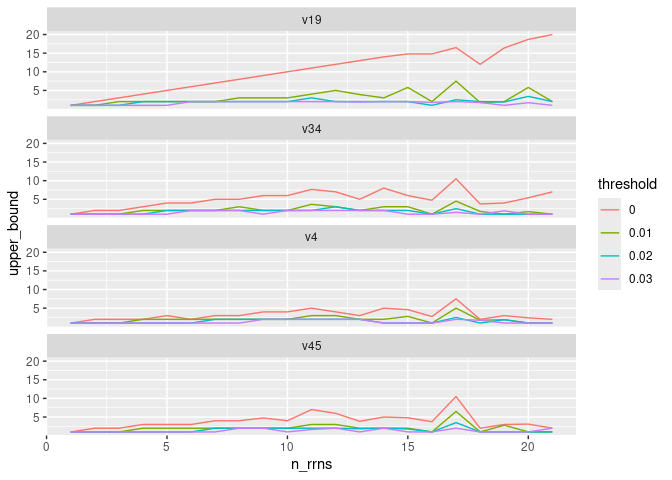
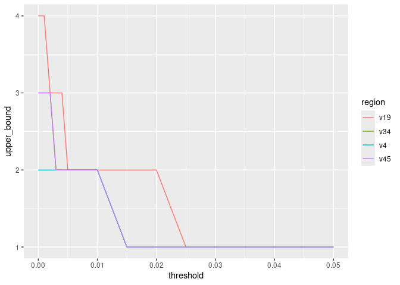

Determine the threshold needed to get 1 ASV per genome
================
G Bhatti; P Schloss
10/13/2024

``` r
library(tidyverse)
library(here)
library(knitr)
set.seed(15091984)
metadata<- read_tsv(here("data/references/genome_id_taxonomy.tsv"),
                    col_types = cols(.default = col_character())) |> 
  select(genome_id,species) |> 
  group_by(species) |> 
  # Get one genome per species
  slice_sample(n=1) |> 
  ungroup()

easv<- read_tsv(here("data/processed/rrnDB.easv.count_tibble"),
                        col_types = cols(.default=col_character(),
                                         count=col_integer())) 


metadata_easv<- inner_join(metadata, easv, by=c("genome_id"="genome")) |> 
  mutate(threshold=case_match(threshold,
                              "esv"~"0.000",
                              .default = threshold),
         threshold=as.numeric(threshold))
```

``` r
easvs_by_threshold_region<- metadata_easv |> 
# Aggregate data by species/genome, region, and threshold, # of rrn operons per genome
  group_by(region,threshold,genome_id) |> 
# Count the number of ASVs per grouping & # of rrn operons per genome
  summarise(n_rrns=sum(count),n_easvs=n(),.groups = "drop") |> 
# Determine the 95th percentile for each region, threshold & # rrns
  group_by(region,threshold,n_rrns) |> 
  summarise(upper_bound = quantile(n_easvs,prob=0.95),.groups = "drop")


# Plot the..
# * 95th percentile as a function of each region, threshold & the # of rrn operons per genome
easvs_by_threshold_region |> 
  filter(threshold %in% c(0,0.01,0.02,0.03)) |> 
  mutate(threshold=as.character(threshold)) |> 
  ggplot(aes(x=n_rrns,y=upper_bound,color=threshold)) + 
  geom_line() +
  facet_wrap(~region,nrow=4)
```

<!-- -->

``` r
# * 95th percentile for those genomes with 7 copies of rrn operons.
easvs_by_threshold_region |> 
  filter(n_rrns == 4) |> 
  ggplot(aes(x=threshold,y=upper_bound,color=region)) + 
  geom_line() 
```

<!-- -->

### Conclusions …

- Analysis depends on our comfort with uncertainty (prob = 90% or 95%)
  and the number of rrn copies per genomes.
- Regardless of the number of operons or region, we need a significantly
  higher threshold than esvs or even “traditional” ASVs are defined at.
  Frankly, 3% doesn’t look so bad for this type of analysis.
