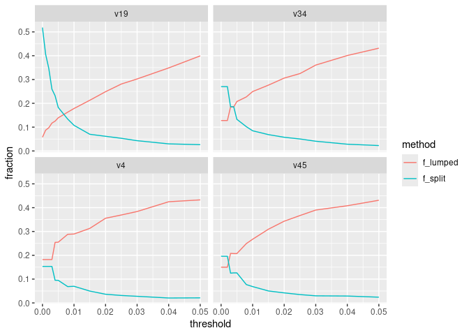
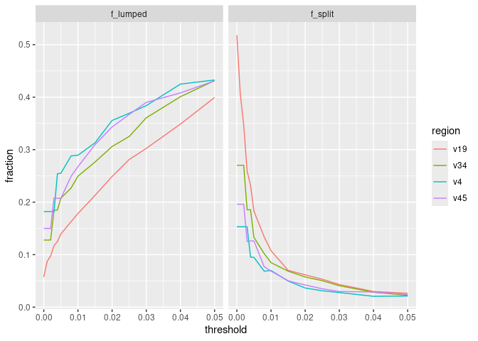
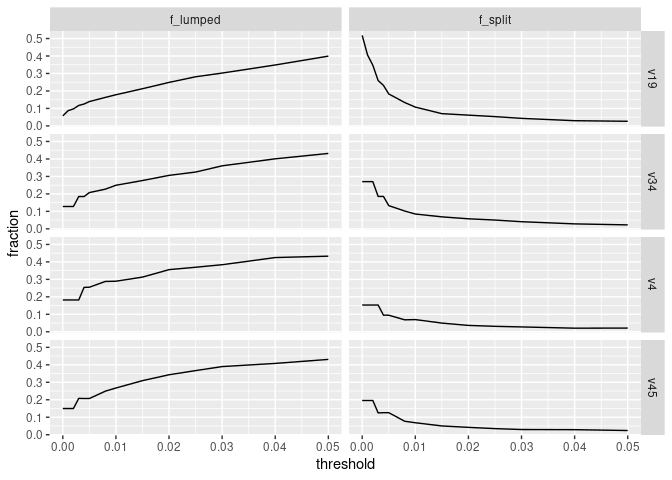
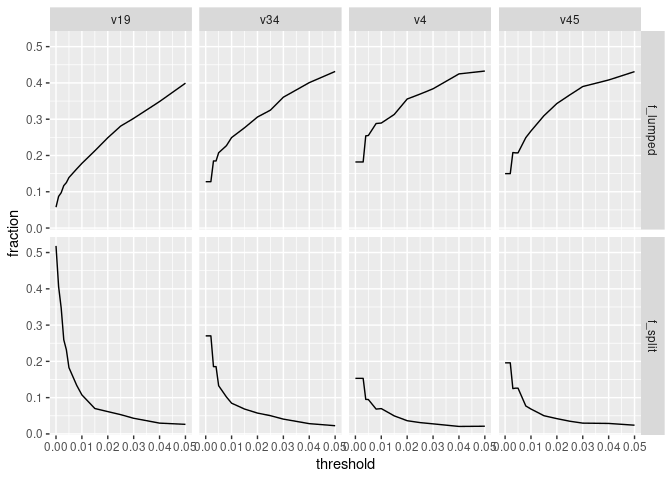

What is the effect of distance threshold on lumping and splitting of
bacterial species and genomes?
================
G Bhatti; P Schloss
11/3/2024

``` r
library(tidyverse)
library(here)
library(knitr)
set.seed(15091984)
metadata<- read_tsv(here("data/references/genome_id_taxonomy.tsv"),
                    col_types = cols(.default = col_character())) |> 
  select(genome_id,species) |> 
  group_by(species) |> 
  # Get one genome per species
  slice_sample(n=1) |> 
  ungroup()

easv<- read_tsv(here("data/processed/rrnDB.easv.count_tibble"),
                        col_types = cols(.default=col_character(),
                                         count=col_integer())) 


metadata_easv<- inner_join(metadata, easv, by=c("genome_id"="genome")) |> 
  mutate(threshold=case_match(threshold,
                              "esv"~"0.000",
                              .default = threshold),
         threshold=as.numeric(threshold))
```

``` r
# Measuring degree of splitting ...
# Determine the fraction of genome with more than one E/ASV by region and threshold
splitting_data<- metadata_easv |> 
# - group data by region, threshold, and genome ids
  group_by(region, threshold, genome_id) |> 
# - determine whether each genome has more than one E/ASV
  summarise(n_easv= n_distinct(easv),
            is_split= n_easv>1,.groups = "drop") |> 
# - for each region and threshold, determine the fraction of genomes with more 
# - than one E/ASV
  group_by(region,threshold) |> 
   summarise(f_split= sum(is_split)/n(),.groups = "drop")


# Measuring degree of lumping ...
# Determine the fraction of E/ASVs found in more than one genome/speies by region and threshold
lumping_data<- metadata_easv |> 
# - group data by region, threshold, and E/ASV
  group_by(region, threshold, easv) |> 
# - determine whether each  E/ASV appear in more than one genome/species
  summarize(n_genome=n_distinct(genome_id),
            is_lump=n_genome>1,.groups="drop") |> 
# - for each region and threshold, determine the fraction of E/ASV that appear in
# - than one genome
    group_by(region,threshold) |> 
  summarise(f_lumped= sum(is_lump)/n(),.groups = "drop")


# Join splitting and lumping data
lumping_splitting_data<-inner_join(splitting_data,lumping_data,by=c("region","threshold")) |> 
# *Tidy so that we have columns for region, threshold, splitting/lumping, and the 
# degree of lumping/splitting
  pivot_longer(cols = c("f_split","f_lumped"),
               names_to = "method",
               values_to="fraction")

# *Plot the degree of lumping/splitting as a function of threshold for each 
# region. Try faceting...
# -By region with lumping/splitting as separate lines
lumping_splitting_data |> 
  ggplot(aes(x=threshold,y=fraction,color=method)) +
  geom_line()+
  facet_wrap(~region) # good
```

<!-- -->

``` r
# -By lumping/splitting with region as separate lines
lumping_splitting_data |> 
  ggplot(aes(x=threshold,y=fraction,color=region)) +
  geom_line()+
  facet_wrap(~method)
```

<!-- -->

``` r
# -By lumping/splitting and byregion
lumping_splitting_data |> 
  ggplot(aes(x=threshold,y=fraction))+
  geom_line()+
  facet_grid(region~method)
```

<!-- -->

``` r
lumping_splitting_data |> 
  ggplot(aes(x=threshold,y=fraction))+
  geom_line()+
  facet_grid(method~region) # also good
```

<!-- -->

### Conclusions …

- As we increase the threshold, plitting drops and lumping increases.
- We need a decent size threshold (\>0.01)to reduce the level of
  splitting.
- We should prefer to limit splitting over lumping because species
  designations are too squishy - human made rather than bacterial made.
