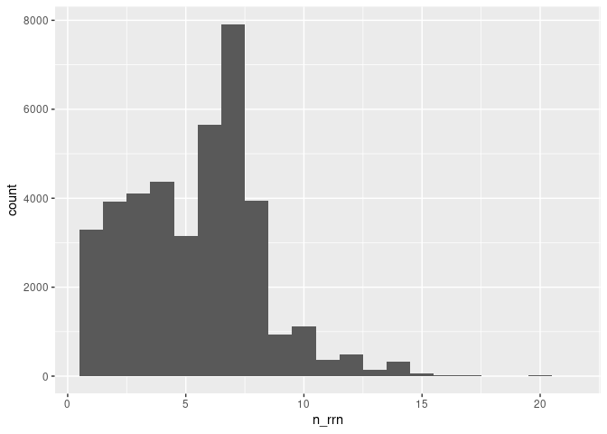
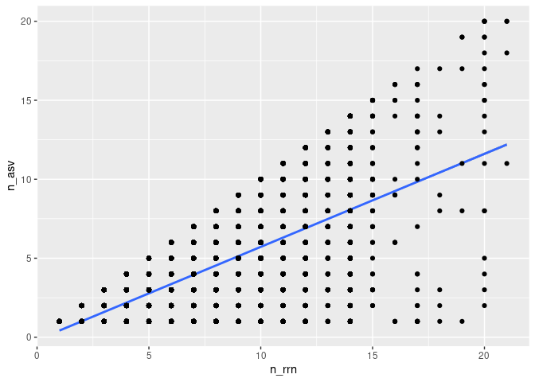
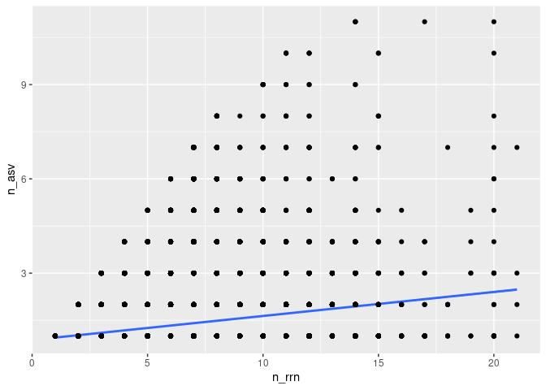

Analyzing the sensitivity and specificity of ASVs for discriminating
between genomes
================
Gaurav Bhatti; Pat Schloss
09/01/2024

``` r
library(tidyverse)
library(here)
```

### Determine the number of *rrn* operons across genomes

Our analysis will use fill length sequences.

``` r
full_length<- read_tsv(here("data/v19/rrnDB.count_tibble"))
```

    ## Rows: 120388 Columns: 3
    ## ── Column specification ─────────────────────────────────────────────────────────────────────────────────────────────────────────────────────────────────────────────────────────────────────
    ## Delimiter: "\t"
    ## chr (2): asv, genome
    ## dbl (1): count
    ## 
    ## ℹ Use `spec()` to retrieve the full column specification for this data.
    ## ℹ Specify the column types or set `show_col_types = FALSE` to quiet this message.

We want to count and plot the number of copies per genome.

``` r
full_length |> 
  group_by(genome) |> 
  summarize(n_rrn = sum(count)) |> 
  ggplot(aes(x=n_rrn))+
  geom_histogram(binwidth = 1)
```

<!-- -->

``` r
full_length |> 
  group_by(genome) |> 
  summarize(n_rrn = sum(count)) |> 
  count(n_rrn) |> 
  mutate(fraction= 100*n/sum(n))
```

    ## # A tibble: 21 × 3
    ##    n_rrn     n fraction
    ##    <dbl> <int>    <dbl>
    ##  1     1  3292     8.26
    ##  2     2  3927     9.85
    ##  3     3  4103    10.3 
    ##  4     4  4371    11.0 
    ##  5     5  3143     7.88
    ##  6     6  5660    14.2 
    ##  7     7  7912    19.8 
    ##  8     8  3942     9.89
    ##  9     9   942     2.36
    ## 10    10  1115     2.80
    ## # ℹ 11 more rows

We see that most genomes (92%) have more than 1 copy of the *rrn*
operon. I wonder whether those different copies are the same
sequence/ASV…

### Determine the number of ASVs per genome

Considering that most genomes have more than 1 copy of the *rrn* operon,
we need to know whether they all have the same ASV. Otherwise we run the
risk of splitting a single genome into multiple ASVs.

``` r
full_length |> 
  group_by(genome) |> 
  summarise(n_asv= n(),
            n_rrn = sum(count)) |> 
  group_by(n_rrn) |> 
  summarize(med_n_asv= median(n_asv),
            lg_n_asv= quantile(n_asv,0.25),
            up_n_asv= quantile(n_asv,0.75))
```

    ## # A tibble: 21 × 4
    ##    n_rrn med_n_asv lg_n_asv up_n_asv
    ##    <dbl>     <dbl>    <dbl>    <dbl>
    ##  1     1         1        1        1
    ##  2     2         1        1        2
    ##  3     3         1        1        2
    ##  4     4         1        1        2
    ##  5     5         3        1        4
    ##  6     6         2        1        4
    ##  7     7         4        3        6
    ##  8     8         5        2        7
    ##  9     9         6        5        8
    ## 10    10         6        3        9
    ## # ℹ 11 more rows

``` r
full_length |> 
  group_by(genome) |> 
  summarise(n_asv= n(),
            n_rrn = sum(count)) |> 
  ggplot(aes(x=n_rrn,y=n_asv))+
  geom_smooth(method = "lm")+
  geom_point()
```

    ## `geom_smooth()` using formula = 'y ~ x'

<!-- -->

Surprisingly (or not) the number of unique ASVs increases at the rate of
about 2 ASVS per 3 copies of *rrn* operon in the genome.

### Determine whether an ASV is specific to the genome they are found in.

Instead of looking at the number of ASVs per genome, we want to see the
number of genomes per ASV.

``` r
full_length |> 
  group_by(asv) |> 
  summarise(n_genomes= n()) |> 
  count(n_genomes) |> 
  mutate(fraction=100*n/sum(n))
```

    ## # A tibble: 170 × 3
    ##    n_genomes     n fraction
    ##        <int> <int>    <dbl>
    ##  1         1 44250   82.2  
    ##  2         2  4581    8.51 
    ##  3         3  1587    2.95 
    ##  4         4   829    1.54 
    ##  5         5   480    0.892
    ##  6         6   370    0.688
    ##  7         7   258    0.479
    ##  8         8   169    0.314
    ##  9         9   116    0.216
    ## 10        10   108    0.201
    ## # ℹ 160 more rows

We see that with full length sequences, 82% of the ASVs were unique to
the genome.

### Does the sensitivity and the specificity change if we add a shorter region?

We know that the V4 region is less diverse than the full length
sequence. So does the number of ASVs per genome differ than for full
length sequences? Are ASVs as specific when using the V4 region compared
to full length sequences?

``` r
v_four<- read_tsv(here("data/v4/rrnDB.count_tibble"))
```

    ## Rows: 51860 Columns: 3
    ## ── Column specification ─────────────────────────────────────────────────────────────────────────────────────────────────────────────────────────────────────────────────────────────────────
    ## Delimiter: "\t"
    ## chr (2): asv, genome
    ## dbl (1): count
    ## 
    ## ℹ Use `spec()` to retrieve the full column specification for this data.
    ## ℹ Specify the column types or set `show_col_types = FALSE` to quiet this message.

``` r
v_four |> 
  group_by(genome) |> 
  summarise(n_asv= n(),
            n_rrn = sum(count)) |> 
  group_by(n_rrn) |> 
  summarize(med_n_asv= median(n_asv),
            lg_n_asv= quantile(n_asv,0.25),
            up_n_asv= quantile(n_asv,0.75))
```

    ## # A tibble: 21 × 4
    ##    n_rrn med_n_asv lg_n_asv up_n_asv
    ##    <dbl>     <dbl>    <dbl>    <dbl>
    ##  1     1         1        1        1
    ##  2     2         1        1        1
    ##  3     3         1        1        1
    ##  4     4         1        1        1
    ##  5     5         1        1        1
    ##  6     6         1        1        1
    ##  7     7         1        1        1
    ##  8     8         1        1        2
    ##  9     9         1        1        2
    ## 10    10         1        1        2
    ## # ℹ 11 more rows

``` r
v_four |> 
  group_by(genome) |> 
  summarise(n_asv= n(),
            n_rrn = sum(count)) |> 
  ggplot(aes(x=n_rrn,y=n_asv))+
  geom_smooth(method = "lm")+
  geom_point()
```

    ## `geom_smooth()` using formula = 'y ~ x'

<!-- -->

The number of ASVs per copy of the *rrn* operon is lower than for full
length sequence. We find 1.5 ASV (median) per 10 copies of the *rrn*
operon.

Next, let’s look at the specificity of an ASV for a genome.

``` r
v_four |> 
  group_by(asv) |> 
  summarise(n_genomes= n()) |> 
  count(n_genomes) |> 
  mutate(fraction=100*n/sum(n))
```

    ## # A tibble: 132 × 3
    ##    n_genomes     n fraction
    ##        <int> <int>    <dbl>
    ##  1         1  9120   74.4  
    ##  2         2  1321   10.8  
    ##  3         3   525    4.28 
    ##  4         4   297    2.42 
    ##  5         5   153    1.25 
    ##  6         6   132    1.08 
    ##  7         7    89    0.726
    ##  8         8    74    0.603
    ##  9         9    53    0.432
    ## 10        10    32    0.261
    ## # ℹ 122 more rows

We found that about 74% of ASVs using the V4 region were specific to a
genome.

### To be determined

- Can we correct for over representation?
- Consider analysis at species, genus, family, etc. levels.
- Consider looking at more broad definition of an ASV (upto 3%
  differences in sequences).
