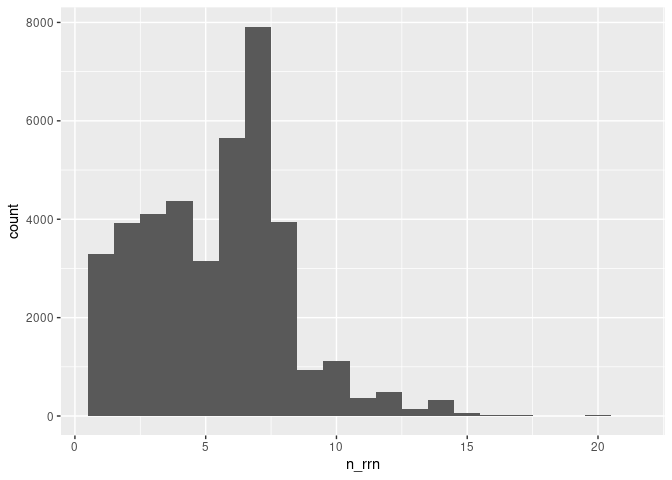
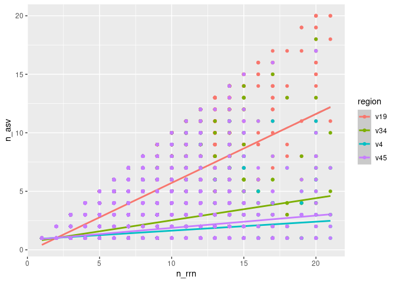

Analyzing the sensitivity and specificity of ESVs for discriminating
between genomes
================
Gaurav Bhatti; Pat Schloss
09/04/2024

``` r
library(tidyverse)
library(here)
```

### Determine the number of *rrn* operons across genomes

Our analysis will use full length sequences. But since we know that the
sub regions are less diverse than the full length sequence. So does the
number of ESVs per genome differ than for full length sequences? Are
ESVs as specific when using the V4 region compared to full length
sequences?

``` r
count_tibble<- read_tsv(here("data/processed/rrnDB.easv.count_tibble"),
                        col_types = cols(.default=col_character(),
                                         count=col_integer())) |> 
  filter(threshold=="esv") |> 
  select(-threshold)
```

We want to count and plot the number of copies per genome.

``` r
count_tibble |> 
  filter(region=="v19") |> 
  group_by(genome) |> 
  summarize(n_rrn = sum(count)) |> 
  ggplot(aes(x=n_rrn))+
  geom_histogram(binwidth = 1)
```

<!-- -->

``` r
count_tibble |> 
  filter(region=="v19") |> 
  group_by(genome) |> 
  summarize(n_rrn = sum(count)) |> 
  count(n_rrn) |> 
  mutate(fraction= 100*n/sum(n))
```

    ## # A tibble: 21 × 3
    ##    n_rrn     n fraction
    ##    <int> <int>    <dbl>
    ##  1     1  3292     8.26
    ##  2     2  3927     9.85
    ##  3     3  4103    10.3 
    ##  4     4  4371    11.0 
    ##  5     5  3143     7.88
    ##  6     6  5660    14.2 
    ##  7     7  7912    19.8 
    ##  8     8  3942     9.89
    ##  9     9   942     2.36
    ## 10    10  1115     2.80
    ## # ℹ 11 more rows

We see that most genomes (92%) have more than 1 copy of the *rrn*
operon. I wonder whether those different copies are the same
sequence/ESV…

### Determine the number of ESVs per genome

Considering that most genomes have more than 1 copy of the *rrn* operon,
we need to know whether they all have the same ESV. Otherwise we run the
risk of splitting a single genome into multiple ESVs.

``` r
count_tibble |> 
  group_by(region,genome) |> 
  summarise(n_esv= n(),
            n_rrn = sum(count)) |> 
  group_by(region,n_rrn) |> 
  summarize(med_n_esv= median(n_esv),
            mean_n_esv=mean(n_esv),
            lg_n_esv= quantile(n_esv,0.25),
            up_n_esv= quantile(n_esv,0.75)) |> 
  filter(n_rrn==7)
```

    ## `summarise()` has grouped output by 'region'. You can override using the `.groups` argument.
    ## `summarise()` has grouped output by 'region'. You can override using the `.groups` argument.

    ## # A tibble: 4 × 6
    ## # Groups:   region [4]
    ##   region n_rrn med_n_esv mean_n_esv lg_n_esv up_n_esv
    ##   <chr>  <int>     <dbl>      <dbl>    <dbl>    <dbl>
    ## 1 v19        7         4       4.13        3        6
    ## 2 v34        7         1       1.88        1        2
    ## 3 v4         7         1       1.38        1        1
    ## 4 v45        7         1       1.52        1        2

``` r
count_tibble |> 
  group_by(region,genome) |> 
  summarise(n_esv= n(),
            n_rrn = sum(count)) |> 
  ggplot(aes(x=n_rrn,y=n_esv,color=region))+
  geom_smooth(method = "lm")+
  geom_point()
```

    ## `summarise()` has grouped output by 'region'. You can override using the `.groups` argument.
    ## `geom_smooth()` using formula = 'y ~ x'

<!-- -->

Surprisingly (or not) the number of unique ESVs increases at the rate of
about 2 ESVS per 3 copies of *rrn* operon in the genome.The sub-regions
of the 16S rRNA gene have fewer ESVs per *rrn* operon.

### Determine whether an ESV is specific to the genome they are found in.

Instead of looking at the number of ESVs per genome, we want to see the
number of genomes per ESV.

``` r
count_tibble |> 
  group_by(region,easv) |> 
  summarise(n_genomes= n()) |> 
  count(n_genomes) |> 
  mutate(fraction=100*n/sum(n)) |> 
  filter(n_genomes==1)
```

    ## `summarise()` has grouped output by 'region'. You can override using the
    ## `.groups` argument.

    ## # A tibble: 4 × 4
    ## # Groups:   region [4]
    ##   region n_genomes     n fraction
    ##   <chr>      <int> <int>    <dbl>
    ## 1 v19            1 44250     82.2
    ## 2 v34            1 15295     77.3
    ## 3 v4             1  9120     74.4
    ## 4 v45            1 12217     77.4

We see that with full length sequences, 82% of the ESVs were unique to
the genome. For the sub regions, about 76% of the ESVs were unique to
the genome.

### To be determined

- Can we correct for over representation?
- Consider analysis at species, genus, family, etc. levels.
- Consider looking at more broad definition of an ESV (upto 3%
  differences in sequences).
